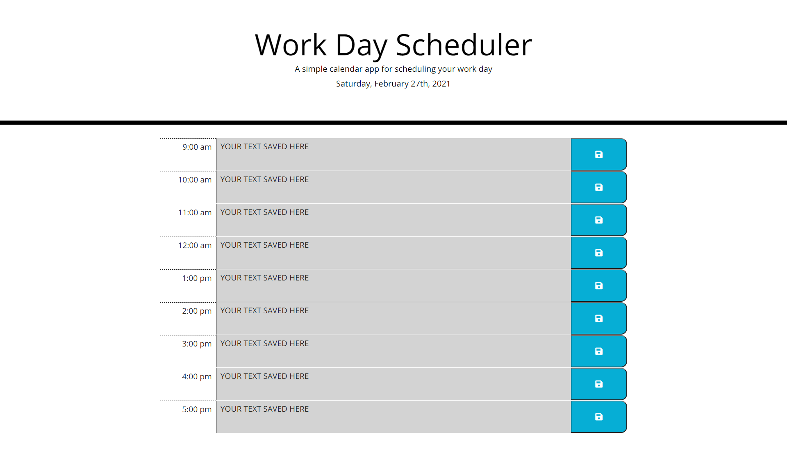

# homework05: Work Day Scheduler

## My Task

Create a simple calendar application that allows a user to save events for each hour of the day by modifying starter code. This app will run in the browser and feature dynamically updated HTML and CSS powered by jQuery.

You'll need to use the [Moment.js](https://momentjs.com/) library to work with date and time. Be sure to read the documentation carefully and concentrate on using Moment.js in the browser.

## Brief

```md
AS AN employee with a busy schedule
I WANT to add important events to a daily planner
SO THAT I can manage my time effectively
```

## Acceptance Criteria

```md
GIVEN I am using a daily planner to create a schedule
WHEN I open the planner
THEN the current day is displayed at the top of the calendar
WHEN I scroll down
THEN I am presented with timeblocks for standard business hours
WHEN I view the timeblocks for that day
THEN each timeblock is color coded to indicate whether it is in the past, present, or future
WHEN I click into a timeblock
THEN I can enter an event
WHEN I click the save button for that timeblock
THEN the text for that event is saved in local storage
WHEN I refresh the page
THEN the saved events persist
```

## Completed Work

While creating this workday planner page I:

* Used moment.js and jquery to display the current day and date

* Created timeblocks ranging throughout the workday's standard hours

* Added a color code indicating the current time of the day using moment.js and jquery

* Created text areas in each time frame where you can store events

* Added proper functionality saving events on click of the save button and redisplaying the events on page reload

* Added some styling for desired appearance

## Screenshot



## Links 

Deployed Application(GitHub Pages): https://mkotte.github.io/homework05/

GitHub Repository: https://github.com/mkotte/homework05
